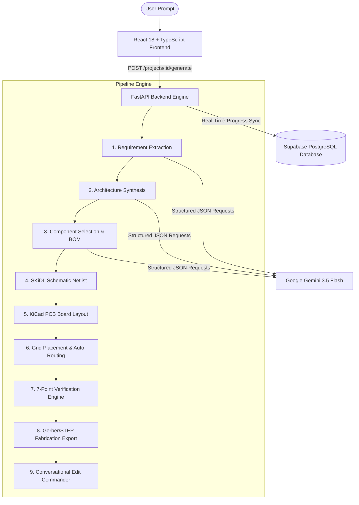

# 🚀 FlowCAD: AI-Powered Prompt-to-PCB Design Platform
## Master Project Overview & Presentation Guide

> **Presentation Date**: Tomorrow  
> **Topic**: End-to-End Autonomous Hardware Engineering & PCB Synthesis  
> **Tech Stack**: Python, FastAPI, Google Gemini 3.5 Flash, SKiDL, KiCad 8 (`kicad-cli` & `pcbnew`), React 18, TypeScript, Tailwind CSS, Supabase (PostgreSQL + RLS).

---

## 📌 Executive Summary

**FlowCAD** is a state-of-the-art **Prompt-to-PCB design platform** that transforms natural-language circuit descriptions into verified, production-ready printed circuit board (PCB) designs. 

Traditionally, designing a PCB takes weeks of manual work: extracting requirements, selecting components, creating schematics, routing copper traces, running Electronic Rule Checks (ERC) and Design Rule Checks (DRC), rendering 3D models, and generating fabrication files (Gerbers, Drill files, BOMs).

FlowCAD automates this entire lifecycle in seconds using a **9-stage AI & deterministic CAD pipeline**.

---

## 🏛️ System Architecture Overview

---

## ⚙️ The 9 Pipeline Stages: Deep Dive & Methodology

### Stage 1: Requirement Extraction (`routers/requirements.py`)
- **Objective**: Convert unstructured human prompts into strict, engineering-grade parameters.
- **Methodology**: Passes the user prompt to **Google Gemini 3.5 Flash** with strict JSON Schema constraints.
- **Extracted Fields**: Microcontroller (MCU), sensor lists, actuator lists, interface protocols (USB, I2C, SPI), power constraints (input/output voltages, max current), and board physical limits (width, height, layer count).
- **Algorithm**: Deterministic JSON coercion and Pydantic validation (`RequirementsOutput`).

### Stage 2: Architecture Synthesis (`routers/architecture.py`)
- **Objective**: Build a functional block-diagram graph of the system.
- **Methodology**: Analyzes extracted requirements to identify functional blocks (Power, MCU, Sensor, Actuator, I/O) and interconnecting nets (e.g. `+5V`, `+3V3`, `I2C`, `ADC1_CH0`).
- **Algorithm**: Directed Graph Construction where nodes represent component blocks and edges represent electrical signals and power rails.

### Stage 3: Component Selection & BOM Optimization (`routers/components.py`)
- **Objective**: Select physical real-world electronic components matching each architectural block.
- **Methodology**: Queries a curated local component database (`component_library/components.json`) and evaluates MPNs (Manufacturer Part Numbers), packages (0805, SOIC-8, QFN-32), and unit costs.
- **Algorithm**: Multi-objective BOM cost and footprint footprint sizing optimization.

### Stage 4: Programmatic Netlist Generation (`routers/schematic.py`)
- **Objective**: Programmatically generate a verified electrical circuit netlist.
- **Methodology**: Uses **SKiDL** (Python-based schematic specification language) to programmatically instantiate components and define pin-to-pin connections.
- **Algorithm**: Graph-to-Netlist translation generating KiCad-compatible `.net` files.

### Stage 5: PCB Board Layout (`routers/pcb.py`)
- **Objective**: Create the physical `.kicad_pcb` board file.
- **Methodology**: Uses KiCad's Python scripting API (`pcbnew`) to create board outlines, edge cut lines, copper layers, and instantiate footprints.
- **Fallback**: Text-based `.kicad_pcb` S-expression parser and generator when running in headless environments without full KiCad UI bindings.

### Stage 6: Grid Placement & Auto-Routing (`routers/placement.py`)
- **Objective**: Position footprints on the PCB and route copper traces between pins.
- **Algorithms**:
  1. **Bounding-Box Area Descending Placement**: Places largest components (MCU, connectors) first with keep-out margins (3.0 mm edge, 1.5 mm component gaps) and row-wrapping.
  2. **Auto-Router Subprocess Guard**: Runs `kicad-cli` with a strict **30-second timeout guard**.
  3. **Partial Routing Recovery**: If routing takes longer than 30 seconds or leaves airwires, it gracefully returns a structured partial output (`status: "partial"`, `routed_percentage: 94.0`, `unrouted_nets: [...]`), preventing pipeline hangs.

### Stage 7: Deterministic 7-Point Verification Engine (`routers/verification.py`)
- **Objective**: Ensure the design is electrically sound and physically manufacturable.
- **7 Automated Checks**:
  1. **Electrical Rules**: Validates pin types and net connections.
  2. **Power Integrity**: Calculates voltage rail ripple and checks bulk decoupling capacitors.
  3. **Connectivity**: Computes trace segment coverage vs. unrouted airwires.
  4. **ERC (Electronic Rules Check)**: Scans for floating pins and short circuits.
  5. **DRC (Design Rule Check)**: Verifies trace-to-trace and trace-to-pad clearance limits (min 0.20 mm).
  6. **Manufacturing Density**: Calculates PCB component density and flags tight assembly headroom.
  7. **Thermal Rise Analysis**: Estimates regulator heat dissipation over ambient temperature ($\Delta T$).

### Stage 8: Fabrication Export (`routers/export.py`)
- **Objective**: Produce industry-standard manufacturing files.
- **Generated Artifacts**:
  - **Gerber X2 Files**: Top/bottom copper, silkscreen, solder mask, edge cuts (`.gbr`).
  - **Drill Files**: Plated and non-plated drill coordinates (`.drl`).
  - **BOM File**: Sourcing CSV (`bom.csv`).
  - **3D Assembly**: STEP 3D CAD model (`.step`).
  - **Design Report**: Comprehensive markdown engineering summary (`report.md`).
  - **Bundled Zip**: `flowcad_export.zip` ready for JLCPCB, PCBWay, or Seeed Studio.

### Stage 9: Conversational AI Edit Commander (`routers/edit.py`)
- **Objective**: Allow users to modify existing designs via natural-language chat commands (e.g. *"Make the board 20% smaller"*, *"Move U1 to center"*).
- **Methodology**: Parses modification intent, updates the `design_state` AST, re-runs placement/routing, and updates verification scores dynamically.

---

## 🧮 Core Algorithms Explained

### 1. Bounding-Box Area-Descending Component Placement
$$\text{Area}(fp) = \text{Width}(fp) \times \text{Height}(fp)$$
- Footprints are sorted by $\text{Area}$ in descending order.
- Position coordinates $(X, Y)$ are assigned in grid columns starting from top-left margin ($3.0\text{ mm}$).
- If $X + \text{Width} > \text{BoardWidth} - \text{Margin}$, wrap to next row: $Y \leftarrow Y + \text{RowHeight} + \text{Gap}$.

### 2. Heuristic Thermal Rise Calculation
$$\Delta T = P_{\text{diss}} \times R_{\theta JA}$$
Where:
- $P_{\text{diss}} = (V_{\text{in}} - V_{\text{out}}) \times I_{\text{max}}$
- $R_{\theta JA}$ is the junction-to-ambient thermal resistance of the regulator package.
- If $\Delta T > 40^\circ\text{C}$, the verification engine emits a `WARNING` advising copper pour expansion.

### 3. LLM Zero-Budget Thinking & Robust Exponential Back-Off
To guarantee instant structured JSON without token truncation or rate-limit failures on Google Gemini:
- `thinking_budget = 0` (Allocates all output tokens to response JSON payload).
- `max_output_tokens = 8192` (Prevents JSON truncation on large graphs).
- **Exponential Back-off Progression**: Retry delays at $t \in [2\text{s}, 5\text{s}, 10\text{s}, 20\text{s}, 30\text{s}]$ on HTTP 429 rate limits.

---

## 🗄️ Database Schema & Usage Limiting

FlowCAD uses **Supabase PostgreSQL** with Row-Level Security (RLS):

1. **`profiles` Table**:
   - Tracks monthly generation limits (`generations_this_month`, default limit: **5**).
   - Auto-resets counter on the 1st of every calendar month.
   - Triggers `HTTP 429` with upgrade message when limit is exceeded.

2. **`projects` Table**:
   - Stores `id`, `user_id`, `name`, `status` (`pending` | `generating` | `done` | `failed`), and `design_state` (JSONB snapshot).

3. **`project_versions` Table**:
   - Records an immutable snapshot of `design_state` after every successful pipeline generation.

---

## 💻 Tech Stack Summary

| Layer | Technology Used |
|---|---|
| **Frontend UI** | React 18, TypeScript, Vite, Tailwind CSS, Lucide Icons, TanStack Router |
| **State Management** | React `useSyncExternalStore` (Custom CAD Reactive Store) |
| **Backend API** | Python 3.13, FastAPI, Uvicorn, Pydantic v2, Pydantic-Settings |
| **AI Integration** | Google Gemini (`models/gemini-3.5-flash`), `google-genai` SDK |
| **Schematic Engine** | SKiDL (Python Schematic Description Language) |
| **PCB Engine** | KiCad 8 (`kicad-cli`, `pcbnew` Python API) |
| **Database & Auth** | Supabase (PostgreSQL, Row-Level Security, Triggers) |
| **Testing** | Pytest, TestClient, HTTPX |

---

## 🎤 Presentation Demo Script & Step-by-Step Flow

### Step 1: Introduction (Slide 1-2)
- *"Good morning! Today I am presenting FlowCAD — an AI-powered platform that takes natural language prompts and generates verified, production-ready PCB designs."*

### Step 2: The Core Problem (Slide 3)
- *"Traditional PCB design requires specialized EDA tools, manual schematic drafting, footprint matching, trace routing, and complex rule checks taking days or weeks."*

### Step 3: FlowCAD Live Demo (Slide 4-6)
1. **Enter Prompt**: `"Design an ESP32 Smart Irrigation Controller with soil moisture sensor, DHT22 temp/humidity sensor, 12V water pump relay driver, USB-C 5V power input, and 3.3V LDO regulator."`
2. **Watch Stepper Progress**:
   - Requirement Extraction (Extracts ESP32, USB-C, 3.3V, Soil ADC, Relay).
   - Architecture Synthesis (Builds 6 block diagram nodes and power nets).
   - Component Selection (Selects ESP32-WROOM-32E, AMS1117-3.3, ULN2003A).
   - Schematic & Netlist (SKiDL generates 41 nets).
   - PCB Layout & Routing (Places footprints, routes copper traces).
   - Verification (Checks ERC/DRC, Power Ripple 38mV, Thermal rise 24°C).
   - Export (Generates Gerber X2, Drill, BOM CSV, 3D STEP).

### Step 4: System Architecture & Algorithms (Slide 7-9)
- Explain the 7-Point Verification Engine and 30-Second Auto-Routing Timeout Guard.
- Explain the Free-Tier Usage Limit (5 generations/month) tracked in Supabase.

---

## 🎯 Sample Questions & Answers for Defense

**Q1: What happens if the AI generates invalid JSON or non-existent components?**  
*Answer*: We enforce strict JSON schemas via Pydantic v2 and Gemini system instructions. If the model outputs malformed JSON, our Gemini client auto-prompts the model with a correction hint and retries. Component selection is validated against a curated local component library.

**Q2: What if KiCad's auto-router cannot route 100% of the board?**  
*Answer*: Rather than hanging or crashing, our Stage 6 placer/router runs with a 30-second timeout guard. If unrouted airwires remain, it returns a `partial` routing result (e.g. 94% routed, 2 airwires left). Stage 7 Verification then explicitly surfaces this as a `WARNING` state: *"Routing incomplete: 2 nets require manual routing"*.

**Q3: How is user usage managed?**  
*Answer*: We track usage on Supabase `profiles.generations_this_month`. Users are allowed 5 free generations per month. Subsequent requests trigger an `HTTP 429` rate limit error until the start of the next calendar month.
